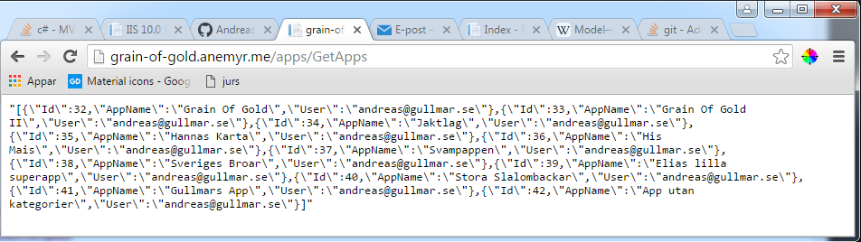

# 1DV449-Projekt

###Rapport
####Inledning 
#####Teknik:
Ramverk Backend: MVC5 (C#).
Ramverk Frontend: Bootstrap, JQuery och Mustach.js.      
Frontend: HTML, CSS, JS.       
Webhotell: Binero.      

###Publicerad
Userinterface:  [ui    grain-of-gold](http://grain-of-gold.anemyr.me/ui)        
Admininterface: [admin grain-of-gold](http://grain-of-gold.anemyr.me)

###Youtube
[Presentationsklipp](https://youtu.be/hY4zGGlQb1s)

###Applikationsidé
Visionen för denna webbapplikationen är att det ska vara möjligt        		
att inom specifika kategorier, kunna skapa minnesmärken (guldkorn).          
På sikt är tanken att flera kategorier kan inkluderas under subkategorier.        
På så vis skulle man kunna få likasinnade personer att dela med sig          
av likande intresseområden. Ett krav är att varje minnesmärke              
ska generera en automatisk centrerad googlekarta.       
Applikationens namn är tillsvidare Grain Of Gold.     
     
###Domämodellering
Domänmodellen består i dagsläget av två many-to-many relationer,        
enlig diagram nedan. Webapplikatione använder sig av ramverkets     
autentiseringsmodell. Diagrammet uteslutar dock denna del.      

Domänmodelleringen för backendsystemet ska vara generellt.            
Trots detta ska det vara möjligt, för en användare,          
att skapa sin egna app (intresseområde)     
Detta har gjorts möjligt med many-to-many relationer av endast      
tree tabeller. Väderdata sparas inte i dagsläget i databasen,       
det är dock halvvägs implementerat. Tanken är att göra      
en cachelösning för att minska antalet förfrågningar                
till openweathermaps api.       

###Databasmodellering
Databasen har genererats med entity framework 6,		
och så kallat codefirst approach.

###Säkerhet & Prestandaoptimering
Applikationens backend är byggt med ASP.NET MVC 5.                   
Validering av data sker genom data annotations.          
Klienten valideras med javscript, för snabbare feedback.                
Kommer klinenten genom första valideringen      
väntas en ny validering när modellens status kontrolleras.      
Det görs enligt angivna annotationsattribute i modelklassen.       
Dessutom är det förhindrat att bindningar kan ske till          
samtliga egenskaper i klassen. Detta är möjligt genom att              
använda attributet bind, tillsammans med en inkluderingslista för                
godkända bindningar.        

Det har gjorts en del tester i loggar för att se över              
så att statiska filer verkas cachas i systemet.     
Inga egna inställningar har gjort då det inte       
ansågs nödvändigt.      

###Offline-first
Grain of Gold har utvecklats med et tydligt mål.             
Att strukturen från domänmodellen bibehålls intakt,     
i sin struktur, ända ut på klienten. 

Ett stort dilemma när det gäller tillvägagångssättet         
offline first, är att man måste hitta ett effektivt     
sätt att behålla status efter en användares interaktion.        

Grain of Gold har i sin nuvarande form ett objekt       
som är en wrapper för applikationens totala status.     
Objektet variabelnämn är State.     
Objektet state sparas ned automatiskt     
till localstorate genom en rekursiv timeout.        
Tidintervallerna för autosparande skulle härmded        
användare själv kunna påverka efter sing egen vilja.

I nuvarande version finns det stöd för t.ex tappat wifi.                      
Man kan utan uppkoppling fortsätta att navigera i menyer,              
trots att man förlorat sin uppkoppling.     
Däremot finns ej stöd för att avsluta webbläsaren              
för att därefter återuppta vid avslut. Detta finns            
det dock utan några större ingrepp möjlighet att fixa.      

Webbapplikationen ger kontinuerlig feedback till användaren                   
gällande enhetens för uppkopplingen. Troligtvis kommer      
nuvarande implementering att kontrolleras/mätas för att se om det är                
eventuellt är för täta anrop. Vilket eventuellt kan ses som negativt.                     
Vidare skulle man dessutom kunna optimera testanropet för att minska       
den totala mängden konsumerad trafik i ändmålet.             

Applikation är framtagen med krav att den       
ska anpassa sig enligt mobile first approach.       
På enheterna som den testats verkar detta fungera              
utan några större probelm. Ramverket Bootstrap      
har varit till ett stort stöd att få dett       
att fungera någorlunda smärtfritt.      

###Använda API:er		
[OpenWeatherMap API](http://openweathermap.org/)
Openweathermap används för att hämta en komplett väderprogns för en sparad plats.
Modellen Forecast återspeglar den JSON som tolkas innan svaret går vidare till Grain Of Gold.

[Google Maps Javascript API](https://developers.google.com/maps/documentation/javascript/tutorial/)		
Google Maps används för att tilldela en markör på sparad plats.
Värt att notera är den dynamiska uppdatering av formuläret - om man väljer
att klicka och dra iväg en markör. Webbapplikation använder sig också av en sökfunktion     
för att hitta en plats och automatsik placera markör i centrum i canvas.

[Grain Of Gold](https://grain-of-gold.anemyr.me)        	
Api:et skapades för att möta approachen offline-first.           
Grain Of Gold har ett publikt ("read-only") api,       
som svara med strukturerad ***JSON***.		
JSON-datat är *speglingar* av applikationens modeller.		

>URL: http://grain-of-gold/app.anemyr.me		
>>Http GET: /apps/GetApps/
>>>Code: 200 Ok.        
>>>Code: 404 Not Found.     

>>Http GET: /apps/GetPlaceForecasts/                        
>>>>Code: 200 Ok.       
>>>>Code: 400 Bad Request.      
>>>>Code: 404 Not Found     
	
>>Http GET: /apps/GetCategoryPlaces/id      
>>>>Code: 200 Ok.       
>>>>Code: 400 Bad Request.      
>>>>Code: 404 Not Found     
		
>>Http GET: /apps/GetAppCategories/id       		
>>>Code: 200 Ok.        
>>>Code: 400 Bad Request.       
>>>Code: 404 Not Found.

---

*Skärmdump: Avser ett lyckate anrop till /apps/GetApps/*

*Skärmdump: Avser ett lyckate anrop till /apps/GetApps/*

*Skärmdump: Avser ett lyckate anrop till /apps/GetApps/*

---

###Risker med din applikation
En etisk risk skulle eventuellt kunna vara om       
användarens syfte är att lagra information som
har med kriminell verksamhet att göra. Även om      
webbapplikationen har ett syfte och ändamål,
att lagra guldkorn, så skulle den redan i nuvarande     
version kunna användas för att planera flykter, gömmor etc.

###Egen reflektion kring projektet

>Nya tekniker     
>>Code First Entity Framework       
>>Mustache.js (js templating)       
>>Binero.se, behov av stöd för ASP.NET      

Mitt primära mål för mig personligen var att utöka      
mina tankebanor hur användarinnehåll genereras och      
hur man som användare med javascript kan bearbeta       
innehållet på klinensidan i webbläsaren. Tidigare       
har jag testat att jobba med mvc som arkitektur.       
Att kunna hantera json i backend både mot servrars      
externa api och egenkodat api var ett stort mål.                
Detta har resulterat i att jag fått viss erfarenhet
av att sätta status beroende på status i objekt     
efter sökningar mot sql server. Detta kan man       
se i appsControllern - de metoder som svara        
med JSON. Sammanfattningsvisk kan man säga så här.      

-"Trodde jag att JSON var viktigt tidigare      
så är det nog trots allt först nu jag verkligen      
förstår poäng med att kunna hantera JSON."       

###Framtiden
1. Att bygga appar som jobbar mot ett komplett CRUD-API.        
2. Att ge användare möjlighet att dela sina appar med varandra.     
3. Att logga in via konto hos facebook      
4. Att nyttja fler av goolge maps api:er        
5. Att låta anändare välja gratis tema.     
6. Att möjliggöra köp av skrädarsydda extensions - efter kundens behov.      
7. Jobba vidare med ett effektivare gränssnitt.     

